# PHP BASICS. Workshop 7. Homework. Тогочакова Евгения

1. При помощи регулярных выражений усильте проверку данных в validateRequestData так, чтобы пользователь не смог передать на обработку любую строку, 
содержащую HTML-теги (например, `<script>`)
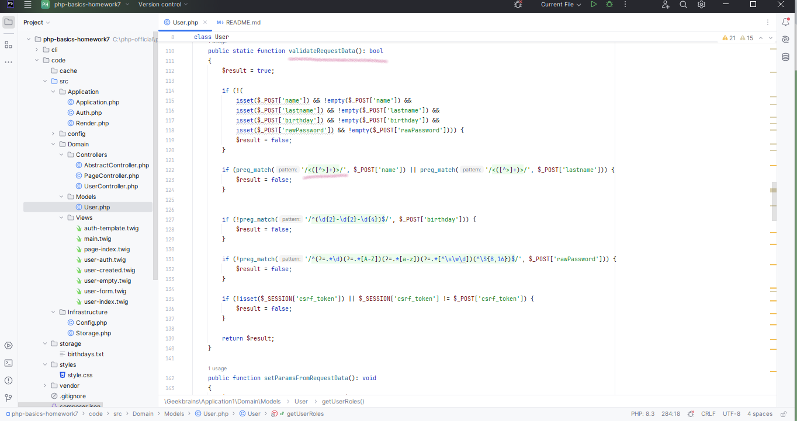

2. Доработайте шаблон аутентификации. В нем нужно добавить две вещи:

В приветствии нужно выводить имя залогинившегося пользователя.
Также надо выводить ссылку «Выйти из системы», которая будет уничтожать сессию пользователя.
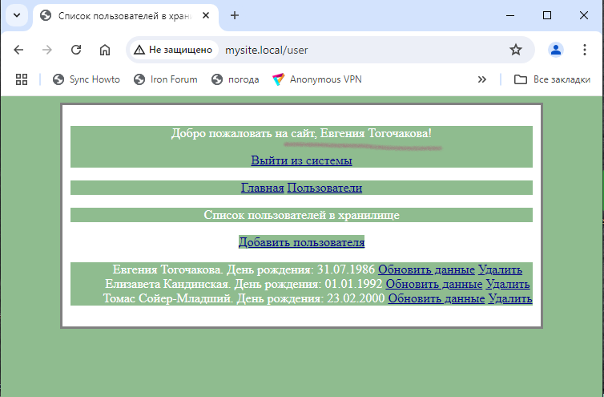
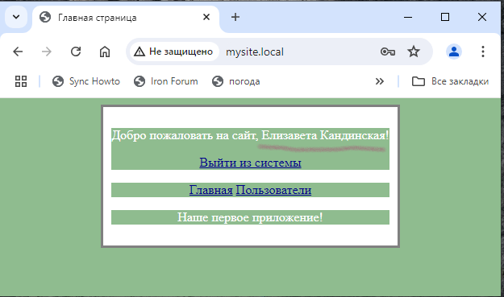

3. Переработайте имеющийся функционал приложения на формы.

Создание, обновление и удаление пользователя теперь должно производиться через формы.
Если пользователь обновляется, в форму должны быть выведены текущие значения. Это может быть сделано ссылкой из списка пользователей 
(рядом с каждым из них будет своя ссылка “Обновить данные”).
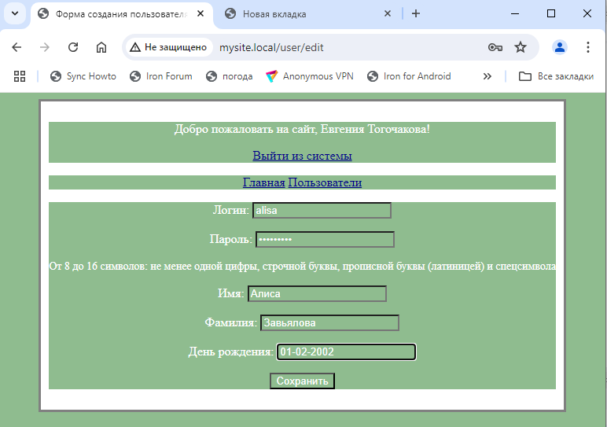
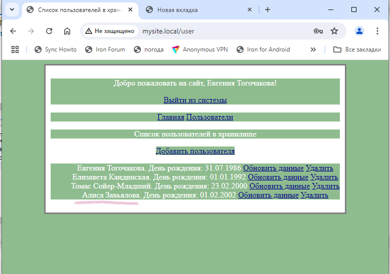
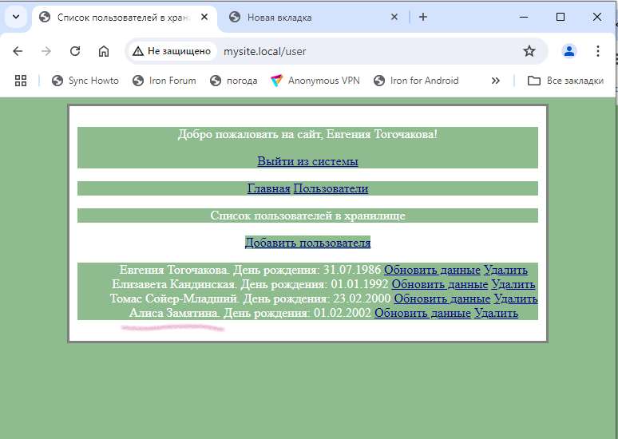
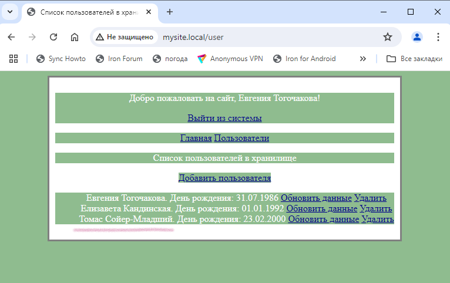

4. *Создайте функцию “Запомнить меня” в форме логина.

В форме должен появиться checkbox “Запомнить меня”.
При нажатии на него в процессе логина пользователю выдаётся cookie, по которому происходит автоматическая авторизация, даже если сессия закончилась.
При логине нужно будет генерировать токен из random_bytes(), размещая его в cookies и БД, чтобы сравнивать их
При выходе из системы токен надо деактивировать.
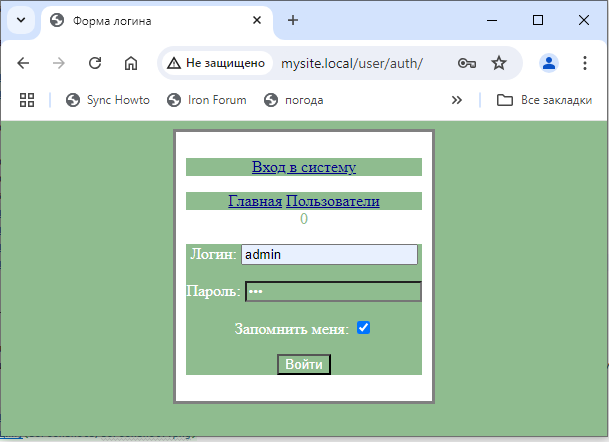
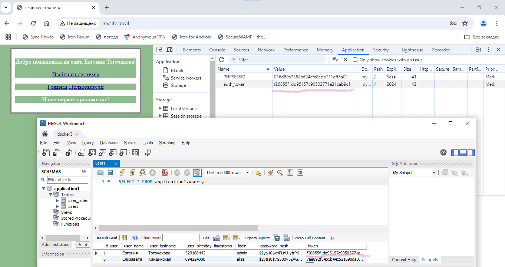
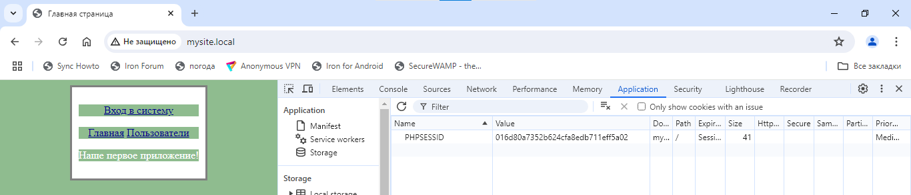

5. Исправьте потолстевший Абстрактный контроллер.
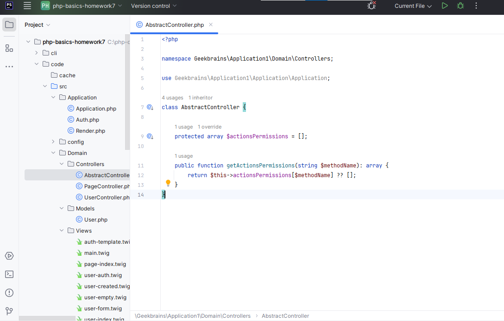